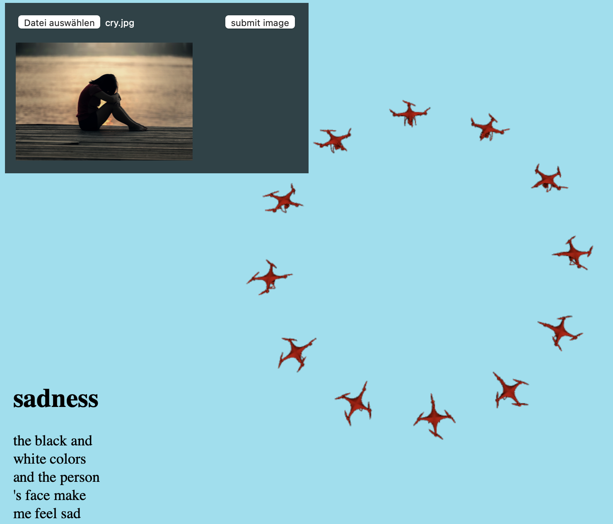

# Imotion


[](https://raw.githubusercontent.com/makokaz/imotion/master/LICENSE)

Imotion is a project created during UTokyo Research Hackathon 2021.  
It understands emotions an external viewer might have while observing an image, and then moves multiple agents in a way that conveys a similar emotion to the viewer.

> The original code submitted to the Hackathon can be found at [this repo](https://github.com/leavez529/Imotion.git).  
> This repository extends the original code for docker-support, includes bugfixes, and modified the visual aspects slightly.  
> The most credit for the original source code goes to:  
    - [adata111](https://github.com/adata111)  
    - [leavez529](https://github.com/leavez529)  
    - [Tanvisn](https://github.com/Tanvisn)



Inspiration for this idea comes from the following paper:
> Santos, M., Egerstedt, M. From Motions to Emotions: Can the Fundamental Emotions be Expressed in a Robot Swarm?. Int J of Soc Robotics 13, 751–764 (2021). <https://doi.org/10.1007/s12369-020-00665-6>

## Getting started 🚀

There are about three ways to start the Imotion webserver:

- [Pulling from Docker](#pulling-docker-image-🐳) (recommended approach)
- [Building Docker image by yourself](#building-docker-image-🐳)
- [Running by source](#running-by-source)

After starting the Imotion webserver, you can access the webservice at: <http://localhost:5000>

### Pulling Docker image 🐳

Simply pull & run the docker image

```bash
docker run -dp 5000:5000 makokaz/imotion
```

That's all! 🎉

### Building Docker image 🐳

1. First, clone this project by

    ```bash
    git clone --recurse-submodules https://github.com/makokaz/Imotion.git
    ```

2. Create docker image

    ```bash
    docker build -t imotion .
    ```

3. Run docker image

    ```bash
    docker run -dp 5000:5000 imotion
    ```

### Running by source

1. First, clone this project by

    ```bash
    git clone --recurse-submodules https://github.com/makokaz/Imotion.git
    ```

2. Pull the trained artemis model from [Google Drive](https://drive.google.com/uc?id=1MvEBUqFCDflL-Y8TllzYUe_-rivb8bmF) and put it in the folder `./server/checkpoints/best_model.pt`.
    > Note: If the model disappeared from the Google Drive folder, it must be first trained as explained in the artemis repo.

3. In the root folder, run

    ```bash
    pip install -e ./artemis/ && pip install -e . && python -m textblob.download_corpora
    ```

4. To start the webserver, run

    ```bash
    flask run
    ```

## Structure

```bash
├── app/      # the website interface files, FLASK
├── artemis/  # artemis image captioning package
├── server/   # back-end, image to emotion functionality
└── app.py    # main file that serves the imotion webserver
```
